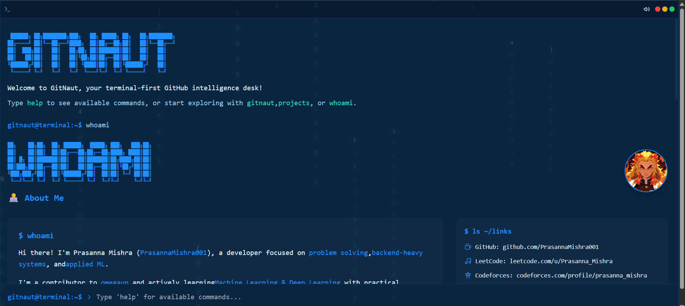
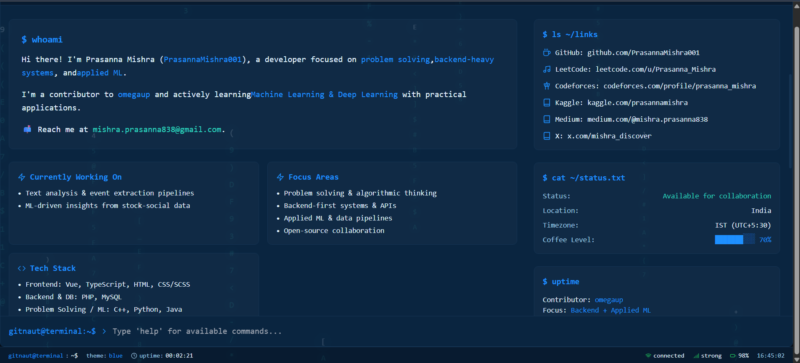
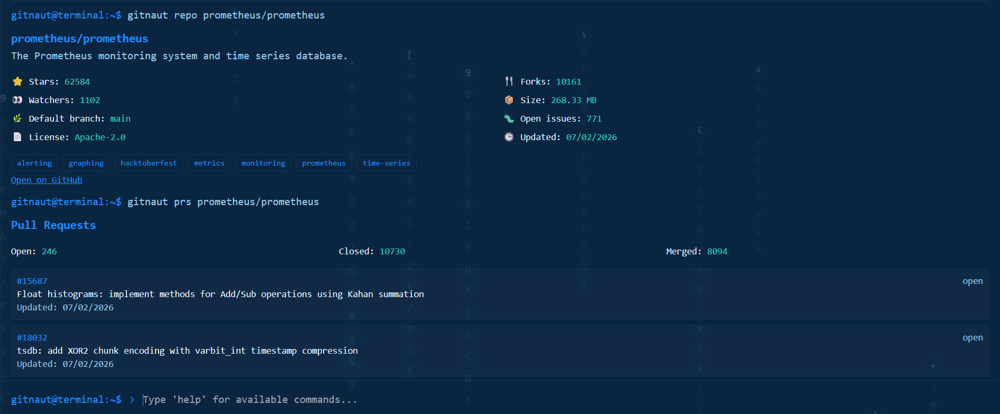

# GitNaut x Portfolio   

**Live:** [git-naut.vercel.app](https://git-naut.vercel.app) &nbsp;|&nbsp; **Portfolio:** [prasannamishra001.github.io/prasannamishra](https://prasannamishra001.github.io/prasannamishra/) &nbsp;|&nbsp; **Resume:** [View PDF](https://drive.google.com/file/d/1azi86BgfU5daak5iSA-Z5VR6YqgsXRj3/view?usp=sharing)

GitNaut is a terminal-first GitHub intelligence desk for fast repo insights — type commands, explore any public repository without leaving the keyboard. Built and maintained by **[Prasanna Mishra](https://prasannamishra001.github.io/prasannamishra/)** (`PrasannaMishra001`), open-source contributor at omegaUp and Research Intern at ABV-IIITM Gwalior.

It acts as a developer dashboard in a terminal skin: pull up repo stats, inspect language breakdowns, visualise PR activity with SVG charts, browse the file tree, and read raw files — all through a command-line interface running in the browser. No login required; just type a GitHub owner/repo and hit Enter.

## Demo Video

https://github.com/user-attachments/assets/a78df4f5-bb41-4cdc-adce-6a0ab2dec549


## 👋 About Prasanna

- 21 merged PRs at [omegaUp](https://github.com/omegaup/omegaup) (Vue 2 · TypeScript · PHP 8.1 · MySQL · Docker)
- Research Intern under Dr. Roshni Chakraborty, ABV-IIITM Gwalior — stock prediction from StockTwits social data
- Knight on LeetCode (rating 1858) · 500+ problems solved
- Focused on **open-source**, **backend systems**, and **applied ML**
- 🌐 Portfolio: [prasannamishra001.github.io/prasannamishra](https://prasannamishra001.github.io/prasannamishra/)
- � Resume: [drive.google.com/…](https://drive.google.com/file/d/1azi86BgfU5daak5iSA-Z5VR6YqgsXRj3/view?usp=sharing)
- �📫 Reach me at: **mishra.prasanna838@gmail.com**

## What GitNaut Does

- Repo summaries, language breakdowns, and quick stats
- Contributor and activity snapshots
- PR/issue counts plus recent items
- File tree inspection and file previews
- Terminal UX with history, autocomplete, and themes

## Tech Stack

- **Frontend**: React, TypeScript, Vite
- **Backend**: Node.js, Express
- **Styling**: Tailwind CSS
- **APIs**: GitHub REST API

## Quick Start

```bash
git clone https://github.com/PrasannaMishra001/gitnaut.git
cd gitnaut
npm install
cd server
npm install
cd ..
npm run dev:all
```

Open `http://localhost:5173` (Vite will pick the next port if 5173 is busy).

## GitHub Token (Local Only)

To avoid GitHub API rate limits, copy [server/.env.example](server/.env.example) to `server/.env` and add:

```
GITHUB_TOKEN=your_token_here
```

`server/.env` is ignored by git.

## Local Env Setup

### Backend (.env)

Create `server/.env` with:

```
GITHUB_TOKEN=your_token_here
GITNAUT_ALLOW_TOKEN_HEADER=false
GITNAUT_ALLOWED_ORIGINS=http://localhost:5173
GITNAUT_CACHE_TTL_MS=60000
PORT=4000
```

### Frontend (optional)

If you run the frontend separately from the backend, set:

```
VITE_API_BASE=https://your-backend-url
```

When using `npm run dev:all`, Vite proxies `/api` to `http://localhost:4000` via [vite.config.ts](vite.config.ts).

## Docs

- PR analysis: [docs/pr-analysis.md](docs/pr-analysis.md)

## Commands

| Command | Description | Example |
| --- | --- | --- |
| `help` | Show available commands | `help` |
| `gitnaut help` | GitNaut analytics help | `gitnaut help` |
| `gitnaut repo` | Repo summary | `gitnaut repo omegaup/omegaup` |
| `gitnaut languages` | Language breakdown | `gitnaut languages owner/repo` |
| `gitnaut contributors` | Top contributors | `gitnaut contributors owner/repo` |
| `gitnaut prs` | PR counts + recent | `gitnaut prs owner/repo` |
| `gitnaut issues` | Issue counts + recent | `gitnaut issues owner/repo` |
| `gitnaut tree` | Top file sizes | `gitnaut tree owner/repo main` |
| `gitnaut file` | File preview + copy | `gitnaut file owner/repo src/App.tsx` |
| `projects` | List projects | `projects` |
| `skills` | Skills matrix | `skills` |
| `contact` | Contact info | `contact` |
| `whoami` | About me | `whoami` |
| `history` | Command history | `history` |
| `theme [name]` | Switch theme | `theme blue` |
| `clear` / `cls` | Clear terminal | `clear` |
| `logout` / `exit` | Exit terminal | `logout` |
| `gitnaut pr-analysis` | PR analysis + graph | `gitnaut pr-analysis owner/repo --focus user` |

## Links

- GitHub: https://github.com/PrasannaMishra001
- LeetCode: https://leetcode.com/u/Prasanna_Mishra/
- Codeforces: https://codeforces.com/profile/prasanna_mishra
- Kaggle: https://www.kaggle.com/prasannamishra
- Medium: https://medium.com/@mishra.prasanna838
- X: https://x.com/mishra_discover

## Screenshots





## 📜 License

MIT. See [LICENSE](LICENSE).
